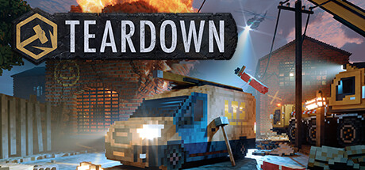

<h1>Teardown Tradução PT_br</h1>

    

<h2>Sobre</h2>
<h4>Versão 1.0</h4>

A tradução está completa e abrange todo o jogo base. Contém erros, pois ainda não foi revisada. Caso queira contribuir com o projeto, fique à vontade para abrir uma issue ou criar um fork.

<h2>Instalação</h2>
<ol>
    <li>Baixe a pasta <strong>text</strong>.</li>
    <li>Abra a pasta de instalação do seu jogo.</li>
    <li>Vá para a pasta <strong>data</strong>.</li>
    <li>Substitua a pasta <strong>text</strong> do seu jogo pela que você baixou deste repositório.</li>
    <li>Abra o jogo, vá em Opções > Jogo e modifique o idioma para Português.</li>
</ol>
